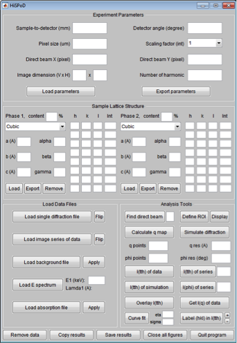

Introduction
============

*HiSPoD* is a Matlab® program, which runs in both Windows and Mac
systems. *Imaging Processing Toolbox* is required for using some of the
functions of this program.

*HiSPoD* is developed for simulating and analyzing undulator white-beam
diffraction patterns from polycrystalline samples. It is particularly
useful when (1) one deals with noisy diffraction patterns, i.e.
single-pulse pattern collected using intensified CCD), (2) an area
detector is placed with an offset angle from the incident direction,
i.e. the detection plane is not perpendicular to the incident beam while
the transmission spot may not fall on the detector, and (3) diffraction
peaks from multiple x-ray harmonic energies co-exist. The major
functions of this GUI include:

- Simulate 2D diffraction pattern from a sample under a given experiment condition 
- Analyze 2D diffraction 

  -  Estimate transmission beam position
  -  Define region of interest (i.e. apply mask)
  -  Calculate map of reciprocal wavevector q
  -  Extract 1D intensity profiles I(tth) and I(q) via radially averaging
  -  Index (hkl) and harmonic peaks

-  Perform curve fitting to quantify strain and phase content

*HiSPoD* aims at providing users with an effective tool for (1)
designing experiments by predicting sample diffraction patterns before
the visit to the synchrotron facility, (2) optimizing parameters and
adjusting work plan by quickly analyzing the experiment data on site,
and (3) fully understanding the data and quantifying the results by
curve fitting after going back to home institution.

|image0|

Figure 1 *HiSPoD* interface

*HiSPoD* consists of four modules:

-  “Experiment Parameters”: users input the parameters associated with
   the detector and experiment geometry.

-  “Sample Lattice Structure”: users input the standard powder
   diffraction intensities of the sample. Such information can be
   obtained from the International Centre for Diffraction Data, in-house
   diffraction experiments, or commercial software, such as
   *CrystalMaker*.

-  “Load Data Files”: in this module, users load the raw data,
   background file, energy spectrum, and absorption file.

-  “Analysis Tools”: this module contains multiple tools for users to
   perform data analysis.
   
   

